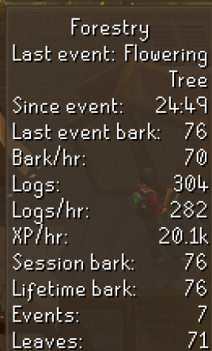
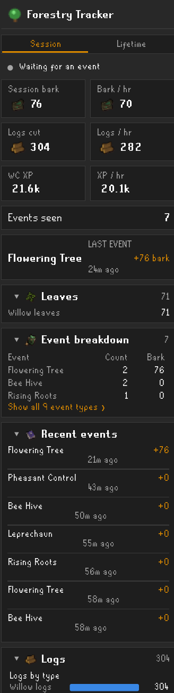
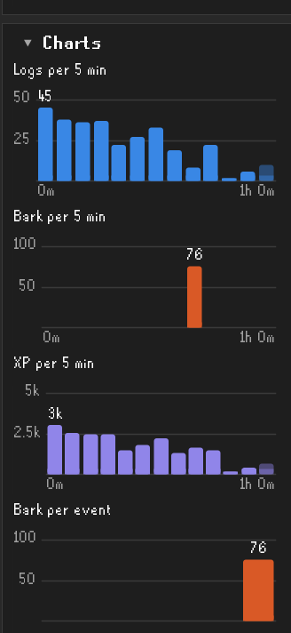
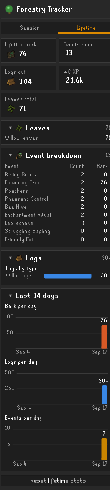

# Forestry Tracker

A RuneLite plugin that tracks Old School RuneScape Forestry events while you woodcut: anima-infused
bark per event and per hour, leaves, logs cut, Woodcutting XP, and a history of every event you've seen,
with session and lifetime views and charts.

## Screenshots

| In-game overlay | Side panel (Session) |
| --- | --- |
|  |  |

| Session charts | Side panel (Lifetime) |
| --- | --- |
|  |  |

## What it shows

**Overlay** (top-left by default, appears once you start chopping or an event is seen):

- Current / last event name, and time since the last event started
- Anima-infused bark from the last event, bark per hour, session bark, lifetime bark
- Logs cut and logs per hour, Woodcutting XP per hour
- Events seen this session
- Leaves gathered this session, optionally broken down by type

Every overlay line can be toggled in the plugin settings.

**Side panel** (tree icon in the sidebar), with a Session tab and a Lifetime tab:

- Stat tiles for bark, bark/hr, logs, logs/hr, XP and XP/hr
- The last event with its bark and how long ago it started
- Collapsible sections: leaves by type, event breakdown (count and bark per event type), recent
  events, logs by type, charts (logs / bark / XP per 5 minutes, bark per event, bark by event type)
  and rates (session duration, events per hour, average bark per event, best event, average gap
  between events, leaves per hour)
- Lifetime tab: the same totals across all sessions on the character, plus bark, logs and events per
  day for the last 14 days
- Reset buttons for the session and for lifetime stats

Everything is saved per character in your RuneLite profile. The current session survives closing the
client (it resumes where it left off, or times out as usual). The session goes idle after a
configurable number of minutes without activity; the next event, log or bark starts a fresh session
unless "New session after timeout" is turned off.

## How it works

- **Bark** is read from the game message `You've been awarded N Anima-infused bark.`, matched
  after stripping the message's colour tags (e.g. `<col=0000ff>...</col>`) and chatbox macros
  (e.g. `@mes_hl_blu@`).
- **Events** are detected from the NPCs and objects each event spawns (the same ids the built-in
  Woodcutting plugin uses). Bark that arrives while an event is active, or within 10 seconds of it
  ending, is added to that event. An event you have earned bark from ends as soon as you go back to
  cutting the tree; if more bark from it arrives later, the same event is resumed rather than counted
  twice. An event you never took part in ends when all of its NPCs and objects are gone.
- **Leaves** are counted one at a time from the kit pickup chat message ("Some [type] leaves fall
  to the ground and you place them into your Forestry kit."), since the client does not push forestry
  kit contents while the kit is closed.
- **Logs** are counted from the "You get some ... logs." message, and **XP** from Woodcutting stat
  changes.

## Known limitations

- Only events you are near enough to render are tracked.
- Leaves are counted from the kit pickup chat message, so a leaf gained by any other means
  (e.g. one already in the kit before the plugin started) is not counted.
- Bark and leaves are only counted for the local player.

## Building

```
gradlew.bat build        # compile + unit tests
gradlew.bat run          # launch RuneLite in developer mode with the plugin loaded
gradlew.bat shadowJar    # build/libs/forestry-tracker-1.0.0-all.jar
```
